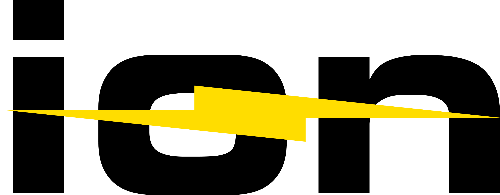
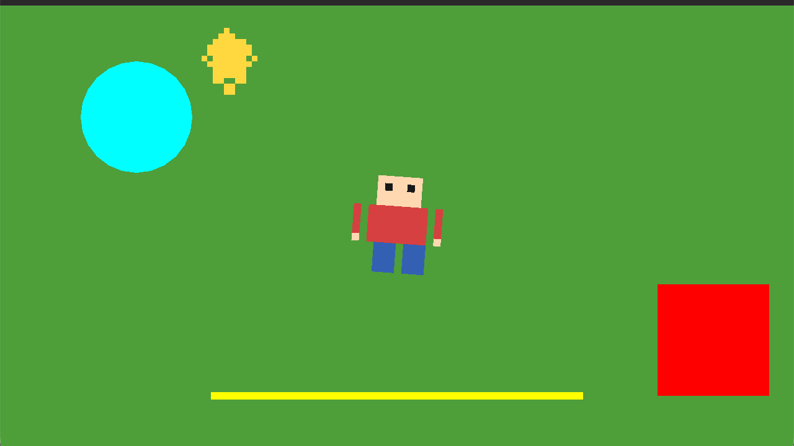
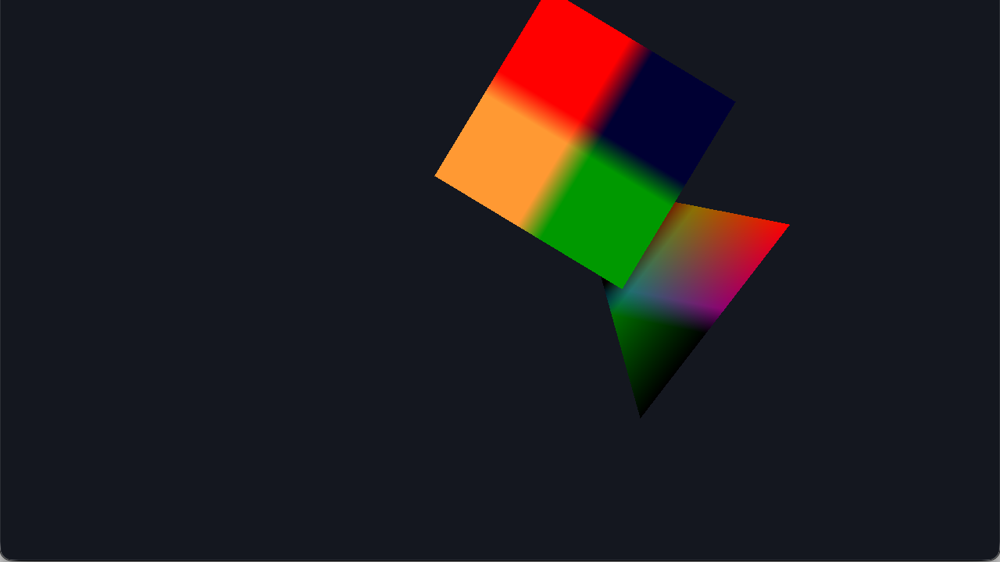

# Ion Engine

Ion Engine is a modern, open-source game engine written in C++ with native support for Windows, macOS, and Linux.

[](LICENSE.md)   

## Features
- Native C++20 architecture
- Cross-platform
- Modern rendering pipeline
- Editor included
- CMake build system

## Supported Platforms


## Rendering Backends

  

- **Metal** — macOSs
- **OpenGL** — Windows, macOS, Linux
- **Vulkan** — planned (see [roadmap](todo.md))

## Build

Requires CMake 3.16+ and a C++20 compiler.

```sh
cmake -S . -B build -DCMAKE_BUILD_TYPE=Release
cmake --build build
```

or via the Makefile wrapper:

```sh
make all       # configure and build
make run       # run the window test
```

Examples build to `build/examples/basic_example`.

## Screenshots



*The 2D example: a tilemap, an animated sprite, a particle emitter, and 2D primitives rendered through `SpriteBatch` (Metal backend).*



*The render example: a checkerboard-textured quad and a color-interpolated triangle in 3D perspective (Metal backend).*

## Documentation

- [Wiki](wiki/README.md)
- [Documentation](docs/README.md)
- [Roadmap](todo.md)

## License

See [LICENSE](LICENSE).